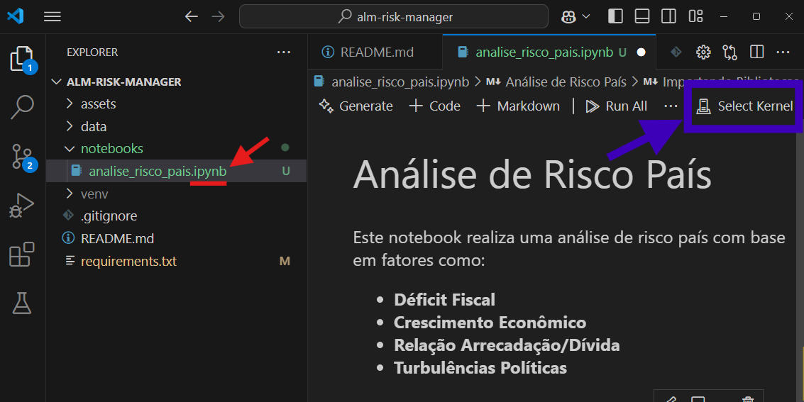
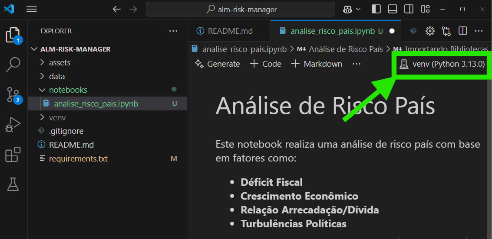
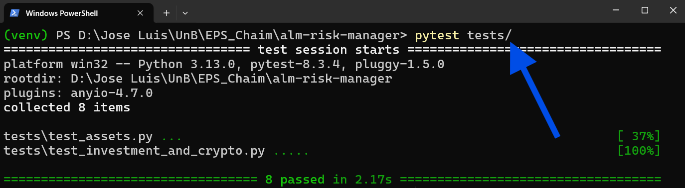

# ALM (Gestão de Riscos)

- [ ] **Análise de Risco País**
- [x] **Gerenciamento de Risco de Taxa de Juros**
- [x] **Gestão de Risco de Investimento**
- [x] **Monitoramento de Risco de Ativos Digitais**

## 1. Configuração do Ambiente

### Requisitos

- `Python` instalado
- `git` instalado
- `pip` para gerenciamento de pacotes

### Passos para Configurar o Ambiente

1. **Clone o Repositório** 

   Clone este repositório em sua máquina local:
   ```bash
   git clone https://github.com/EPS-ALM/alm-risk-manager.git
   cd alm-risk-manager
   ```

2. **Crie um Ambiente Virtual**

    No diretório do projeto, crie o ambiente virtual:
    ```bash
    python -m venv venv
    ```

3. **Ative o Ambiente Virtual**

    - Windows:
    ```bash
    .\venv\Scripts\activate
    ```

    - Linux/macOS:
    ```bash
    source venv/bin/activate
    ```

4. Instale as Dependências

    Com o ambiente virtual ativado, instale as dependências do projeto:
    ```bash
    pip install -r requirements.txt
    ```

<br></br>

## 2. Ativando o Ambiente Virtual no VS Code

1. Certifique-se de que o ambiente virtual (`venv`) foi criado e ativado no terminal.
2. Abra um arquivo notebook (`.ipynb`) no VS Code.
3. Clique em **Select Kernel** no topo da interface do notebook.
4. Selecione o ambiente virtual que você criou.




<br></br>

## 3. Testando com pytest

O projeto utiliza `pytest` para validar as funções e garantir que o código esteja funcionando corretamente. Para rodar os testes:

1. Certifique-se de que o ambiente virtual esteja ativado.
2. Execute o comando:
    ```bash
    pytest tests/
    ```

Isso executará todos os testes localizados na pasta `tests/` e exibirá um relatório com o resultado.

Exemplo de saída esperada:



<br></br>

## 4. Gerando Arquivos HTML dos Notebooks

O script `scripts/convert_ipynb_to_html.py` permite converter notebooks Jupyter (`.ipynb`) em arquivos HTML para facilitar a visualização ou compartilhamento.

### Como Usar

1. Certifique-se de que o ambiente virtual esteja ativado.
2. Execute o script no terminal:
    ```shell
    python scripts/convert_ipynb_to_html.py
    ```

### O que o script faz:
- Converte todos os notebooks da pasta `notebooks/` para arquivos HTML.
- Salva os arquivos HTML na pasta `notebooks/notebooks_html/`.
- Sobrescreve apenas se o conteúdo gerado for diferente.

Se algum notebook estiver vazio ou com erro de formatação, o script exibirá uma mensagem de erro correspondente.


<br></br>

## 5. Desativando o Ambiente Virtual
No terminal desative o ambiente virtual com:
```bash
deactivate
```
