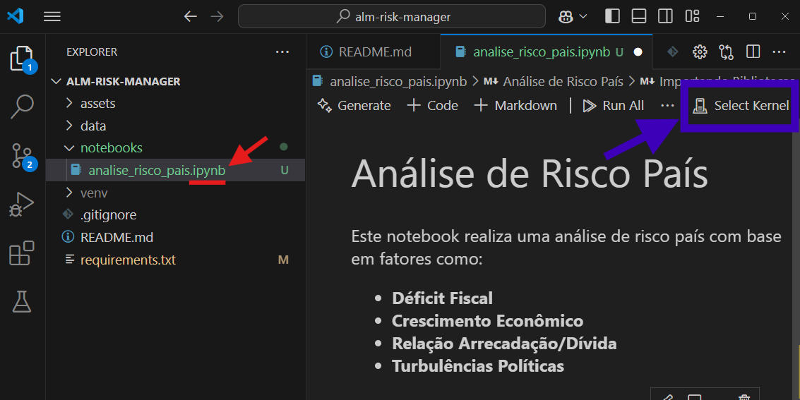
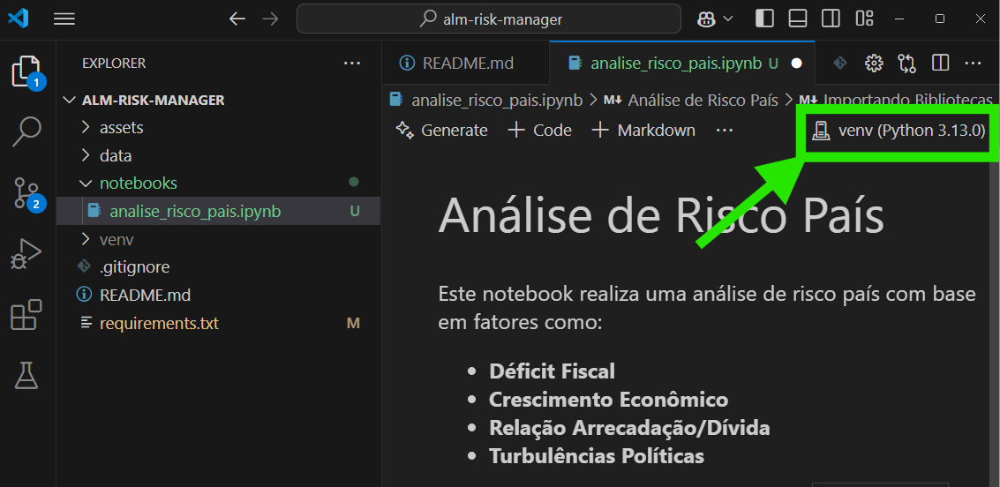

# ALM (Gestão de Riscos)

- [ ] **Análise de Risco País**
- [x] **Gerenciamento de Risco de Taxa de Juros**
- [x] **Gestão de Risco de Investimento**
- [ ] **Monitoramento de Risco de Ativos Digitais**

## 1. Configuração do Ambiente

### Requisitos

- `Python` instalado
- `git` instalado
- `pip` para gerenciamento de pacotes

### Passos para Configurar o Ambiente

1. **Clone o Repositório** 

   Clone este repositório em sua máquina local:
   ```bash
   git clone https://github.com/EPS-ALM/alm-risk-manager.git
   cd alm-risk-manager
   ```

2. **Crie um Ambiente Virtual**

    No diretório do projeto, crie o ambiente virtual:
    ```bash
    python -m venv venv
    ```

3. **Ative o Ambiente Virtual**

    - Windows:
    ```bash
    .\venv\Scripts\activate
    ```

    - Linux/macOS:
    ```bash
    source venv/bin/activate
    ```

4. Instale as Dependências

    Com o ambiente virtual ativado, instale as dependências do projeto:
    ```bash
    pip install -r requirements.txt
    ```

<br></br>

## 2. Ativando o Ambiente Virtual no VS Code

1. Certifique-se de que o ambiente virtual (`venv`) foi criado e ativado no terminal.
2. Abra um arquivo notebook (`.ipynb`) no VS Code.
3. Clique em **Select Kernel** no topo da interface do notebook.
4. Selecione o ambiente virtual que você criou.





<br></br>

## 3. Desativando o Ambiente Virtual
No terminal desative o ambiente virtual com:
```bash
deactivate
```
